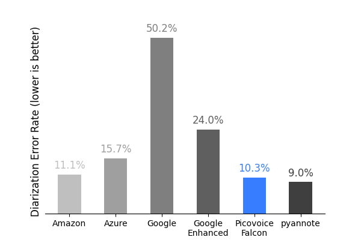
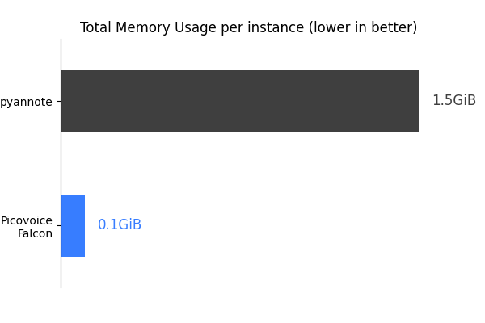
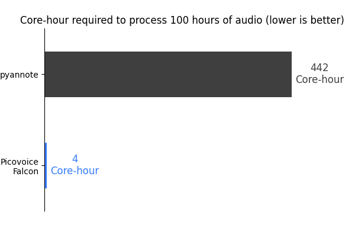

# Speaker Diarization Benchmark

Made in Vancouver, Canada by [Picovoice](https://picovoice.ai)

This repo is a minimalist and extensible framework for benchmarking different speaker diarization engines.

## Table of Contents

- [Data](#data)
- [Metrics](#metrics)
- [Engines](#engines)
- [Usage](#usage)
- [Results](#results)

## Data

### [VoxConverse](https://www.robots.ox.ac.uk/~vgg/data/voxconverse/)

VoxConverse is a well-known dataset in the speaker diarization field, showcasing speakers conversing in multiple
languages. In this benchmark, we utilize cloud-based Speech-to-Text engines equipped with speaker diarization
capabilities. Hence, for benchmarking purposes, we specifically employ the English subset of the dataset's test section.

### Setup

1. Clone the [VoxConverse repository](https://github.com/joonson/voxconverse). This repository contains only the labels
   in the form of `.rttm` files.
2. Download the test set from the links provided in the `README.md` file of the cloned repository and extract the
   downloaded files.

## Metrics

### Diarization Error Rate (DER)

The Diarization Error Rate (DER) is the most common metric for evaluating speaker diarization systems. DER is
calculated by summing the time duration of three distinct errors: speaker confusion, false alarms, and missed
detections. This total duration is then divided by the overall time span.

### Jaccard Error Rate (JER)

The Jaccard Error Rate (JER) is a newly developed metric for evaluating speaker diarization, specifically designed for
DIHARD II. It is based on the Jaccard similarity index, which measures the similarity between two sets of segments. In
short, JER assigns equal weight to each speaker's contribution, regardless of their speech duration. For a more in-depth
understanding, refer to the second DIHARD's [paper](https://arxiv.org/abs/1906.07839).

### Total Memory Usage

This metric provides insight into the memory consumption of the diarization engine during its processing of audio files.
It presents the total memory utilized, measured in gigabytes (GB).

### Core-Hour

The Core-Hour metric is used to evaluate the computational efficiency of the diarization engine, indicating the number
of hours required to process one hour of audio on a single CPU core. 

> [!NOTE]
> `Total Memory Usage` and `Core-Hour` metrics are not applicable to cloud-based engines.

## Engines

- [Amazon Transcribe](https://aws.amazon.com/transcribe/)
- [Azure Speech-to-Text](https://azure.microsoft.com/en-us/services/cognitive-services/speech-to-text/)
- [Google Speech-to-Text](https://cloud.google.com/speech-to-text)
- [Picovoice Falcon](https://picovoice.ai/)
- [pyannote.audio](https://github.com/pyannote/pyannote-audio)

## Usage

This benchmark has been developed and tested on `Ubuntu 20.04` using `Python 3.8`.

1. Set up your dataset as described in the [Data](#data) section.
2. Install the requirements:

  ```console
  pip3 install -r requirements.txt
  ```

3. In the commands that follow, replace `${DATASET}` with a supported dataset, `${DATA_FOLDER}` with the path to the
   dataset folder, and `${LABEL_FOLDER}` with the path to the label folder. For further details, refer to
   the [Data](#data). Replace `${TYPE}` with `ACCURACY`, `CPU`, or `MEMORY` for accuracy, CPU benchmark, and memory
   benchmark, respectively.

```console
python3 benchmark.py \
--type ${TYPE} \
--dataset ${DATASET} \
--data-folder ${DATA_FOLDER} \
--label-folder ${LABEL_FOLDER} \
--engine ${ENGINE} \
...
```

4. For the memory benchmark, you should also run `mem_monitor.py` in a separate terminal window. This script will
   monitor the memory usage of the diarization engine.

```console
python3 mem_monitor.py --engine ${ENGINE}
```

when the benchmark is complete, press `Ctrl + C` to stop the memory monitor.

Additionally, specify the desired engine using the `--engine` flag. For instructions on each engine and the required
flags, consult the section below.

#### Amazon Transcribe Instructions

Create an S3 bucket. Then, substitute `${AWS_PROFILE}` with your AWS profile name and `${AWS_S3_BUCKET_NAME}`
with the created S3 bucket name.

```console
python3 benchmark.py \
--dataset ${DATASET} \
--data-folder ${DATA_FOLDER} \
--label-folder ${LABEL_FOLDER} \
--engine AWS_TRANSCRIBE \
--aws-profile ${AWS_PROFILE} \
--aws-s3-bucket-name ${AWS_S3_BUCKET_NAME}
```

#### Azure Speech-to-Text Instructions

A client library for the Speech to Text REST API should be generated, as outlined in
the [documentation](https://learn.microsoft.com/en-us/azure/ai-services/speech-service/swagger-documentation).

Then, create an Azure storage account and container, and replace `${AZURE_STORAGE_ACCOUNT_NAME}` with your Azure storage
account name, `${AZURE_STORAGE_ACCOUNT_KEY}` with your Azure storage account key, and `${AZURE_STORAGE_CONTAINER_NAME}`
with your Azure storage container name.

Finally, replace `${AZURE_SUBSCRIPTION_KEY}` with your Azure subscription key and `${AZURE_REGION}` with your Azure
region.

```console
python3 benchmark.py \
--dataset ${DATASET} \
--data-folder ${DATA_FOLDER} \
--label-folder ${LABEL_FOLDER} \
--engine AZURE_SPEECH_TO_TEXT \
--azure-storage-account-name ${AZURE_STORAGE_ACCOUNT_NAME} \
--azure-storage-account-key ${AZURE_STORAGE_ACCOUNT_KEY} \
--azure-storage-container-name ${AZURE_STORAGE_CONTAINER_NAME} \
--azure-subscription-key ${AZURE_SUBSCRIPTION_KEY} \
--azure-region ${AZURE_REGION}
```

#### Google Speech-to-Text Instructions

Create a Google cloud storage bucket. Then, replace `${GCP_CREDENTIALS}` with the path to your GCP credentials
file (`.json`) and `${GCP_BUCKET_NAME}` with your GCP bucket name.

```console
python3 benchmark.py \
--dataset ${DATASET} \
--data-folder ${DATA_FOLDER} \
--label-folder ${LABEL_FOLDER} \
--engine GOOGLE_SPEECH_TO_TEXT \
--gcp-credentials ${GCP_CREDENTIALS} \
--gcp-bucket-name ${GCP_BUCKET_NAME} \
```

To utilize the enhanced model, replace the `GOOGLE_SPEECH_TO_TEXT` engine with `GOOGLE_SPEECH_TO_TEXT_ENHANCED`.

#### Picovoice Falcon Instructions

Replace `${PICOVOICE_ACCESS_KEY}` with AccessKey obtained from [Picovoice Console](https://console.picovoice.ai/).

```console
python3 benchmark.py \
--dataset ${DATASET} \
--data-folder ${DATA_FOLDER} \
--label-folder ${LABEL_FOLDER} \
--engine PICVOICE_FALCON \
--picovoice-access-key ${PICOVOICE_ACCESS_KEY}
```

#### pyannote.audio Instructions

Obtain your authentication token to download pretrained models by visiting
their [Hugging Face page](https://huggingface.co/pyannote/speaker-diarization).
Then replace `${PYANNOTE_AUTH_TOKEN}` with the authentication token.

```console
python3 benchmark.py \
--dataset ${DATASET} \
--data-folder ${DATA_FOLDER} \
--label-folder ${LABEL_FOLDER} \
--engine PYANNOTE \
--pyannote-auth-token ${PYANNOTE_AUTH_TOKEN}
```

## Results

Measurement is carried on an `Ubuntu 20.04` machine with AMD CPU (`AMD Ryzen 7 5700X (16) @ 3.400G`), 64 GB of
RAM, and NVMe storage.

### Diarization Error Rate (DER)

|      Engine       | VoxConverse (English) |
|:-----------------:|:---------------------:|
|      Amazon       |        11.05%         |
|       Azure       |        15.69%         |
|      Google       |        50.16%         |
| Google - Enhanced |        23.98%         |
| Picovoice Falcon  |        10.34%         |
|  pyannote.audio   |         8.95%         |



### Jaccard Error Rate (JER)

|      Engine       | VoxConverse (English) |
|:-----------------:|:---------------------:|
|      Amazon       |        29.83%         |
|       Azure       |        30.09%         | 
|      Google       |        83.36%         |
| Google - Enhanced |        57.57%         |
| Picovoice Falcon  |        19.92%         |
|  pyannote.audio   |        27.45%         |


### Total Memory Usage

|      Engine      | Memory Usage (GB) |
|:----------------:|:-----------------:|
|  pyannote.audio  |       1.52        |
| Picovoice Falcon |       0.13        |



### Core-Hour

|      Engine      | Core-Hour |
|:----------------:|:---------:|
|  pyannote.audio  |  441.85   |
| Picovoice Falcon |   3.92    |


